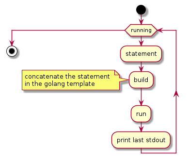
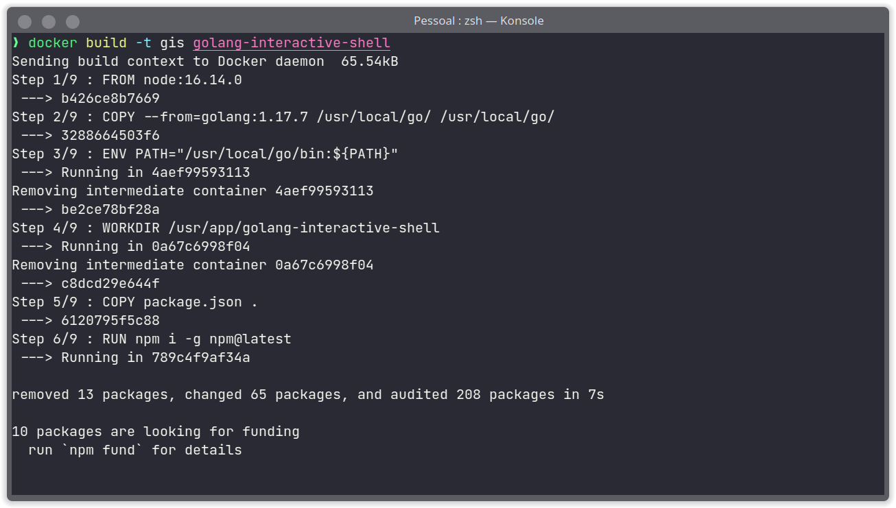
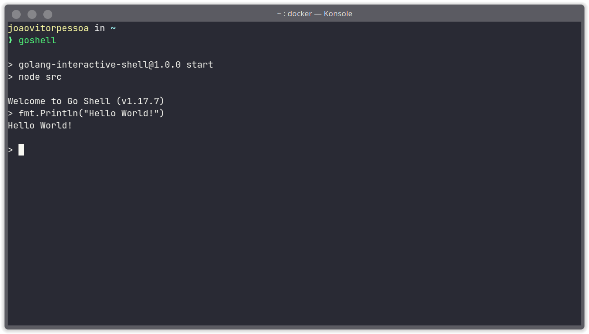

# Interactive shell for GoLang

## Description
I'm studying golang and couldn't find a native interactive shell or an project easy to install/use, so I created my own. As my needs grow, I intend to update the project.
For now, the work of app is very simple with less than 100 lines of code that can be summarized by the flowchart below.

 

## Requirements
This project uses Docker. To install it, check out the [reference](https://docs.docker.com/get-docker/).


## Installation

Download the project:

```bash
git clone https://github.com/joaovitorpessoa/golang-interactive-shell

```

Build the docker image:
```bash
docker build -t gis golang-interactive-shell
```


## Usage

Run the project:
```bash
docker run -it --rm gis
```

On Linux you can create a shortcut to run the interactive shell more easily:
```bash
# puts inside your file of run command (rc) of bash (if you use zsh or other, modify the code with your specific shell) 
echo '\nalias goshell="docker run -it --rm gis"' >> ~/.bashrc
```
Restart the terminal to take effect on open. Now to run the project use:
```bash
goshell
```

On Windows, the same can be done by environment variables.

### Exiting from shell
Type `.exit` or just use the hotkey "Ctrl" + "C".